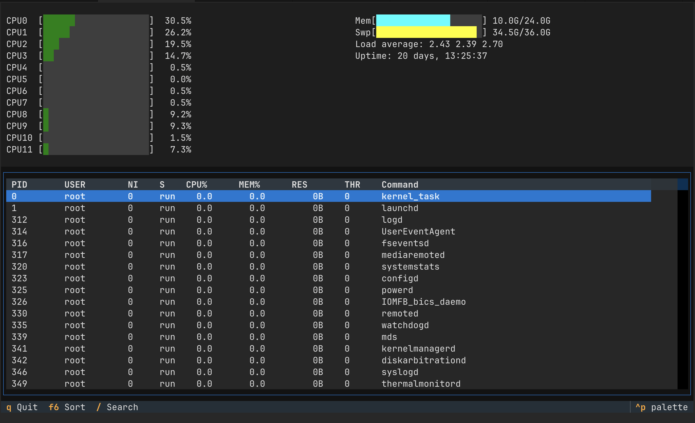

# pytop

[](https://www.python.org/downloads/)
[](https://opensource.org/licenses/MIT)
[](https://pypi.org/project/pytop/)

A Python system monitor (htop clone) built with Textual and psutil. Features real-time CPU, memory, and process monitoring in a terminal UI.

## Features

- Real-time per-core CPU usage visualization
- Memory and swap usage with progress bars
- Load average and system uptime display
- Process table with sorting (CPU, MEM, PID, USER)
- Keyboard navigation
- Zero-lag UI via threaded architecture
- Graceful error handling for permission issues

## Requirements

- Python 3.12+
- psutil >= 6.0
- textual >= 0.50.0

## Installation

```bash
pip install -e .
```

## Usage

```bash
pytop
```



## Keybindings

| Key | Action |
|-----|--------|
| `q` / `F10` | Quit |
| `F6` / `>` | Cycle sort column |
| `/` | Search (coming soon) |

## Architecture

- **SystemMonitor**: Daemon thread polling system data via psutil
- **PytopApp**: Textual TUI receiving updates via thread-safe Queue
- **ProcessSnapshot**: Frozen dataclass with `__slots__` for memory efficiency

## License

MIT
